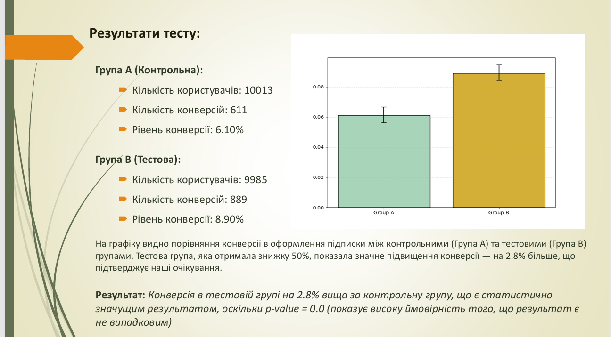

# A/B Testing: 50% Discount on Subscription Conversion

This project analyzes the impact of a 50% discount on subscription conversion using A/B testing. It includes hypothesis setup, statistical testing, and visual insights.

---

## 📁 Files

- [AB test.ipynb](./AB%20test.ipynb) — Jupyter Notebook with full analysis
- [ab_testing.pdf](./ab_testing.pdf) — Downloadable Final case study report
- `statistical_analysis.png` — Screenshot: t-test and chi-squared test results
- `test_results.png` — Screenshot: overall test summary and conversion rates

---

## 🧪 Summary

- **Control group (A):** 6.1% conversion (611 / 10,013)
- **Test group (B):** 8.9% conversion (889 / 9,985)
- **Lift:** +2.8%
- **Statistical significance:**  
  - t-statistic: 56.14  
  - p-value: 0.0 ✅

---

## 🖼️ Visuals

### Statistical Analysis

---

### Test Results

---

## ✅ Conclusion

The 50% discount resulted in a statistically significant improvement in subscription conversion. Based on these results, implementing the discount permanently was recommended.

---
